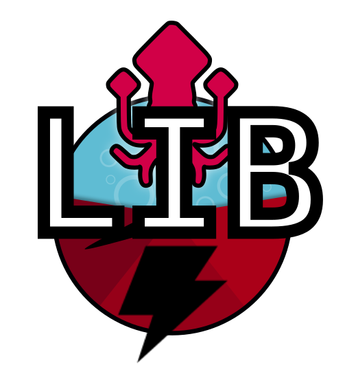

KaMI-lib (Kraken Model Inspector) - Light version
=====


[](https://github.com/KaMI-tools-project/KaMI-lib-light/actions/workflows/tests.yml)
[](https://badge.fury.io/py/kamilib-light)
[](https://opensource.org/licenses/MIT)

A light version of KaMI-lib containing only the transcription metrics module (without Kraken). 


## :electric_plug: Installation

### User installation

Use pip to install package:

```bash
$ pip install kamilib-light
```

### Developer installation

1. Create a local branch of the kami-lib light project

```bash
$ git clone https://github.com/KaMI-tools-project/KaMI-lib-light.git
```

2. Create a virtual environment

```bash
$ virtualenv -p python3.7 venv
```

then 

```bash
$ source kami_venv/bin/activate
```

3. Install dependencies with the requirements file

```bash
$ pip install -r requirements.txt
```

4. Run the tests 

```bash
$ python -m unittest tests/*.py -v
```

## :key: Quickstart

Please, follow the documentation of [kami-lib](https://github.com/KaMI-tools-project/KaMi-lib) and ignore part 2 (with Kraken engine).

Note that instead of importing Kami-lib like this:

```python
from kami.Kami import Kami
```

Replace by this:

```python
from kami_light.Kami import Kami
```

## :question: Do you have questions, bug report, features request or feedback?

#### Please use the issue templates:

#### :beetle: Bug report: [here](https://github.com/KaMI-tools-project/KaMI-lib-light/issues/new?assignees=&labels=&template=bug_report.md&title=)
#### :fireworks: Features request: [here](https://github.com/KaMI-tools-project/KaMI-lib-light/issues/new?assignees=&labels=&template=feature_request.md&title=)

*if aforementioned cases does not apply, feel free to open an issue.*

## :black_nib: How to cite

```
@misc{Kami-lib-light,
    author = "Lucas Terriel (Inria - ALMAnaCH) and Alix Chagué (Inria - ALMAnaCH)",
    title = {Kami-lib - Kraken model inspector, a light version},
    howpublished = {\url{https://github.com/KaMI-tools-project/KaMI-lib-light}},
    year = {2022}
}
```

## :octopus: License and contact

Distributed under [MIT](./LICENSE) license. The dependencies used in the project are also distributed under compatible license.

Mail authors and contact: Alix Chagué (alix.chague@inria.fr) and Lucas Terriel (lucas.terriel@inria.fr)

*KaMI-lib-light* is a part of [KaMI-tools-project](https://github.com/KaMI-tools-project) and developed and maintained by authors (2022) 
with contributions of [ALMAnaCH](http://almanach.inria.fr/index-en.html) at [Inria](https://www.inria.fr/en) Paris.


[](https://www.python.org/)
